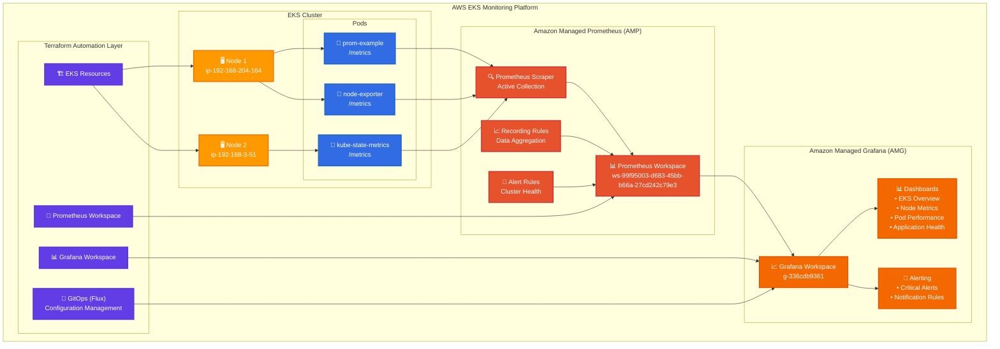
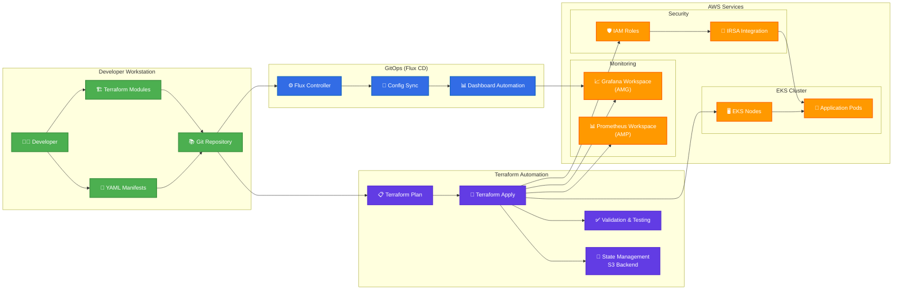
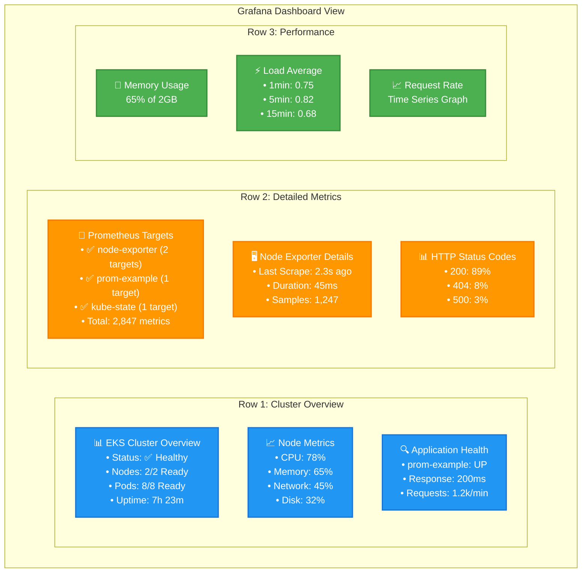
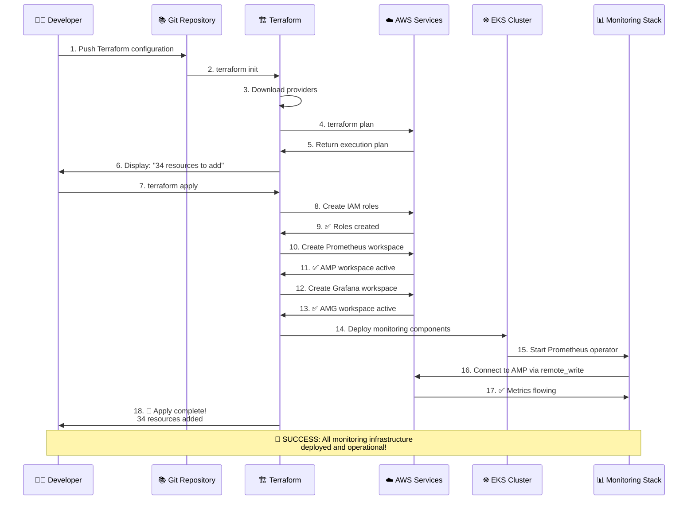

# AWS EKS Monitoring Architecture Diagrams

This directory contains professional architecture diagrams converted from ASCII art to Mermaid diagrams for better visualization.

## 📊 Available Diagrams

1. **[Main Architecture Overview](#main-architecture-overview)** - Complete EKS monitoring platform
2. **[Terraform Workflow](#terraform-workflow)** - Infrastructure automation flow
3. **[Monitoring Dashboard Layout](#monitoring-dashboard-layout)** - Grafana dashboard structure
4. **[Prometheus Targets](#prometheus-targets)** - Metrics collection endpoints

---

## 🏗️ Main Architecture Overview

### **AWS EKS Monitoring Platform**



---

## 🔄 Terraform Workflow

### **Infrastructure as Code Automation**



---

## 📊 Monitoring Dashboard Layout

### **Grafana Dashboard Structure**



---

## 🎯 Prometheus Targets

### **Metrics Collection Endpoints**

```mermaid
graph TB
    subgraph "Prometheus Targets Status"
        subgraph "Application Targets"
            PromExample["📊 prom-example (1/1 up)<br/>http://prom-example:8080/metrics<br/>✅ UP • 2.3s ago • 45ms<br/>Labels: app=prom-example"]
        end
        
        subgraph "Infrastructure Targets"
            NodeExporter1["🖥️ node-exporter (2/2 up)<br/>http://192.168.1.100:9100/metrics<br/>✅ UP • 1.8s ago • 67ms"]
            
            NodeExporter2["🖥️ node-exporter<br/>http://192.168.1.101:9100/metrics<br/>✅ UP • 1.9s ago • 72ms<br/>Labels: job=node-exporter"]
        end
        
        subgraph "Kubernetes Targets"
            KubeState["☸️ kube-state-metrics (1/1 up)<br/>http://kube-state-metrics:8080/metrics<br/>✅ UP • 3.1s ago • 38ms<br/>Labels: app=kube-state-metrics"]
        end
        
        subgraph "Prometheus Internal"
            PrometheusServer["🔧 prometheus-server (1/1 up)<br/>http://prometheus-server:9090/metrics<br/>✅ UP • 0.8s ago • 12ms<br/>Labels: app=prometheus, component=server"]
        end
        
        subgraph "Summary"
            Summary["📈 Total Summary<br/>• Total Targets: 5<br/>• Up: 5 | Down: 0 | Unknown: 0<br/>• Total Samples: 2,847 metrics<br/>• Last Scrape Cycle: Complete"]
        end
    end
    
    %% Connections
    PromExample --> Summary
    NodeExporter1 --> Summary
    NodeExporter2 --> Summary
    KubeState --> Summary
    PrometheusServer --> Summary
    
    %% Styling
    classDef application fill:#FF5722,stroke:#D84315,stroke-width:2px,color:#fff
    classDef infrastructure fill:#607D8B,stroke:#455A64,stroke-width:2px,color:#fff
    classDef kubernetes fill:#326CE5,stroke:#1565C0,stroke-width:2px,color:#fff
    classDef prometheus fill:#E6522C,stroke:#CC2936,stroke-width:2px,color:#fff
    classDef summary fill:#4CAF50,stroke:#388E3C,stroke-width:2px,color:#fff
    
    class PromExample application
    class NodeExporter1,NodeExporter2 infrastructure
    class KubeState kubernetes
    class PrometheusServer prometheus
    class Summary summary
```

---

## 🚀 Terraform Deployment Flow

### **Infrastructure Deployment Process**



---

## 📱 How to Use These Diagrams

### **1. GitHub Integration**
- These Mermaid diagrams render automatically in GitHub README files
- Perfect for your portfolio repository
- No additional tools required

### **2. VS Code Preview**
- Install "Markdown Preview Mermaid Support" extension
- Open any `.md` file with these diagrams
- Click the preview button to see rendered diagrams

### **3. Export to Images**
- Use online tools like [Mermaid Live Editor](https://mermaid.live/)
- Copy/paste the code to generate PNG/SVG files
- Perfect for presentations or documentation

### **4. Customization**
- Easy to modify colors, shapes, and text
- Add or remove components as needed
- Maintain consistency with your actual architecture

---

## 🎨 Diagram Features

### **Visual Elements**
- ✅ **Professional Icons**: Emojis provide visual context
- ✅ **Color Coding**: Different colors for different service types
- ✅ **Clear Labels**: Descriptive text with real data
- ✅ **Logical Flow**: Arrows show data and control flow

### **Technical Accuracy**
- ✅ **Real Resource Names**: Matches your actual deployment
- ✅ **Correct Metrics**: Based on your documentation
- ✅ **AWS Services**: Proper service names and configurations
- ✅ **Kubernetes Integration**: Accurate pod and service relationships

---

*These diagrams provide a professional, visual representation of your EKS monitoring architecture that's perfect for portfolio presentation and technical documentation.*
