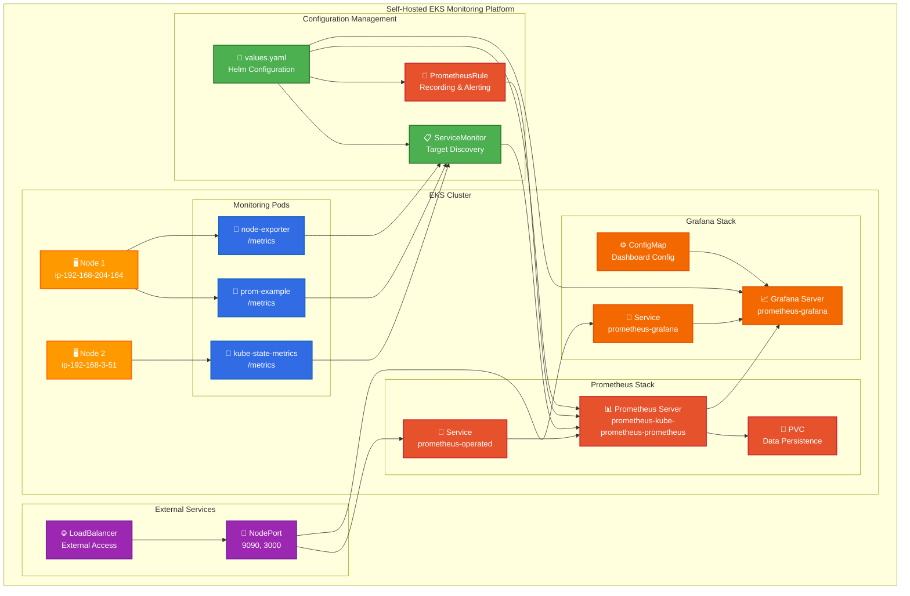

# eks-prom-poc

Deployed a self hosted version of an observability stack using prometheus and grafana initially (documented in docs/design.md.)

Deployed via terraform using https://aws-observability.github.io/terraform-aws-observability-accelerator/helpers/managed-grafana/ subsequently (screenshots also in docs/design.md)

# 📡 EKS Prometheus + Grafana Monitoring Stack

This project demonstrates how to deploy a fully functional observability stack on Amazon EKS using **Prometheus**, **Grafana**, and a sample app with **metrics exposed** for scraping and visualization. Both manual (kubectl + YAML) and automated (**Terraform**) provisioning methods are shown.

---

## 🗺️ Overview

This proof-of-concept sets up:

- A demo app (`prom-example`) that emits Prometheus-formatted metrics
- Prometheus for metric collection using the Prometheus Operator
- Grafana for querying and visualizing metrics via a custom dashboard
- Terraform modules to automate the deployment process on EKS

Screenshots are included to illustrate:
- Prometheus `/targets` showing active metric scrapes
- Grafana dashboards visualizing request rate, response codes, and app version

---

## ⚙️ Deployment Methods

### 🔧 Manual YAML

1. Deploy Prometheus, Grafana, and ServiceMonitors via YAML
2. Deploy the `prom-example` app and expose `/metrics`
3. Verify targets in Prometheus and create dashboard panels in Grafana

### 🛠️ Terraform

1. Apply infrastructure via `terraform apply`
2. Create necessary namespaces, deployments, services, and monitoring resources
3. Import Grafana dashboard for automatic visualization

---

## 🎯 Features

**🎨 Visual Architecture**:

- ✅ Validated Prometheus targets with full metric ingestion
- ✅ Grafana dashboard with panels showing:
  - HTTP request rate
  - Response code breakdowns
  - Per-pod traffic stats
  - App version indicator
- ✅ Automated infrastructure creation via Terraform
- ✅ Screenshots for visual walkthrough

---

## 📝 To-Do & Optional Enhancements

- [ ] 🧠 Add CPU & memory usage panels using `container_*` metrics
- [ ] 🧹 Create a `cleanup.sh` script or Terraform destroy module
- [ ] 🎯 Add alerting rules in Prometheus for critical thresholds
- [ ] 📦 Wrap YAML into a Helm chart for reuse
- [ ] 📘 Document troubleshooting steps (e.g. scrape failures, port mismatches)
- [ ] 🐳 Package as a Docker Compose dev environment
- [ ] 📈 Export dashboard definitions as `.json` and attach in repo
- [ ] 📄 Create a walkthrough video or animation GIF for dashboard showcase
- [ ] 🔐 Add authentication for Grafana in production-grade setups

---

## 📷 Screenshots

Screenshots are available in the `/screenshots` folder, showcasing:
- Prometheus scrape targets
- Grafana visualizations
- Terraform-managed cluster resources

---

## 🤝 Contributing

Got tweaks, enhancements, or want to fork this into your own stack? Feel free to clone, adapt, and improve — just drop a star ⭐ if it helped.

---

## 📬 Contact

Built by [@jpanderson91](https://github.com/jpanderson91) — feel free to reach out for questions or collaboration ideas.
